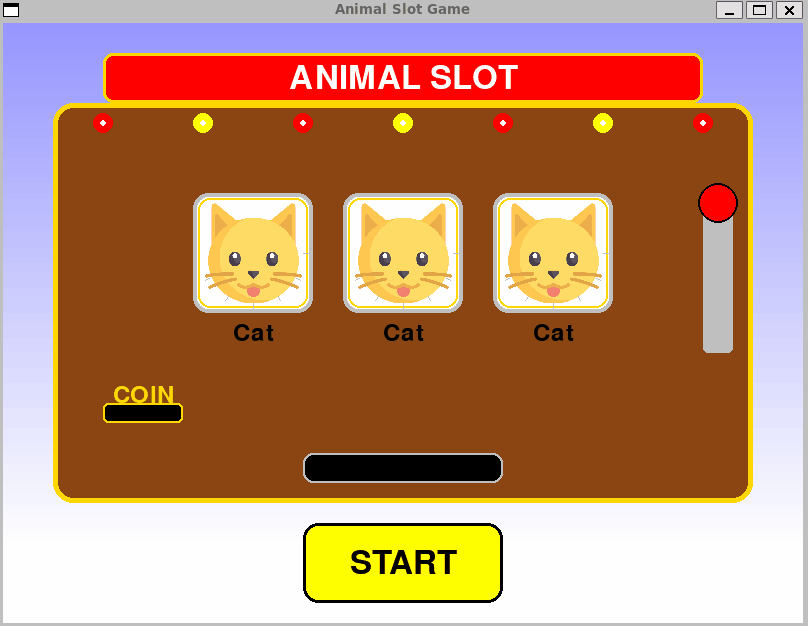

# 🎰 かわいい動物スロットゲーム 🎮

<div align="center">


**6 歳の子ども向けに作られた、シンプルでかわいい動物のスロットゲーム！**

</div>

## 🌟 特徴

- 🐱 かわいい動物の画像を使用したスロットゲーム
- 🎯 シンプルで子どもでも簡単に遊べるインターフェース
- 🎉 3 つの動物が揃うと「CONGRATULATIONS!」の表示が点滅
- 🎰 リアルなスロットマシンのデザイン
- 🕹️ 本物のようなレバーアニメーション

## 📋 遊び方

1. 「START」ボタンをクリックしてスロットを回します
2. レバーが動き、スロットが回転します
3. 3 つの動物の絵柄が揃うと「CONGRATULATIONS!」と表示されます
4. 何度でも「START」ボタンを押して遊べます

## 🐾 登場する動物たち

| 動物          | 英語名 | 特徴                   |
| ------------- | ------ | ---------------------- |
| 😺 ねこ       | Cat    | かわいい表情の猫       |
| 🐶 いぬ       | Dog    | 元気いっぱいの犬       |
| 🐨 コアラ     | Koala  | ふわふわのコアラ       |
| 🐼 パンダ     | Panda  | 丸くてかわいいパンダ   |
| 🦥 ナマケモノ | Sloth  | ゆっくり動くナマケモノ |

## 🛠️ 必要なもの

- Python 3.6 以上
- Pygame

## 📥 インストール方法

```bash
# リポジトリをクローン
git clone https://github.com/yourusername/animal-slot-game.git
cd animal-slot-game

# 仮想環境を作成して有効化（推奨）
python -m venv venv
source venv/bin/activate  # Linuxの場合
# venv\Scripts\activate  # Windowsの場合

# Pygameのインストール
pip install pygame
```

## 🚀 実行方法

```bash
python animal_slot_game.py
```

## 🎬 ゲームデモ

<div align="center">
  
</div>
